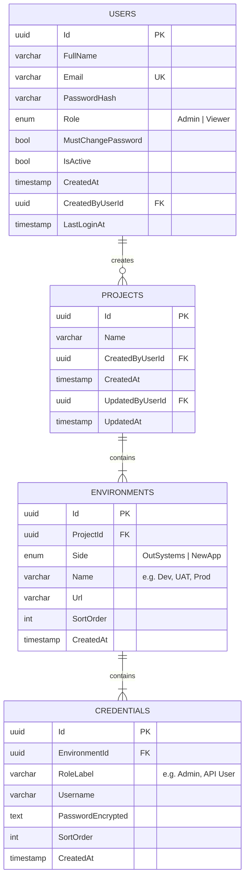

# Product Requirements Document — Shift Portal

**Status:** Draft v1.0
**Date:** 2026-07-27
**Prepared for:** Pragya
**Prepared by:** Claude (Claude Code)

---

## 1. Overview

The Shift Portal is an internal web application for tracking the **migration ("shift") of projects from OutSystems to a new technology stack**. For every project being migrated, the portal stores structured details of both sides of the migration — the original OutSystems application and the newly built replacement — including their environment URLs and access credentials, so this information lives in one governed place instead of scattered documents or chat threads.

## 2. Problem Statement

When a project is shifted off OutSystems to a new stack, the details needed to access both the old and new systems (URLs per environment, login credentials per role) currently have no single source of truth. This portal centralizes that information with proper access control and credential protection.

## 3. Goals

- One place to record, browse, and retrieve OutSystems ↔ New App migration details per project.
- Support multiple environments per side (Dev, UAT, Prod, etc.), each with its own URL and its own set of role-based credentials.
- Protect stored credentials (encryption at rest, masked display).
- Role-based access: some users can only view, others can manage data.
- Allow exporting project data to Excel for offline sharing.

### Non-Goals (v1)

- No integration with actual OutSystems or target-stack APIs (this is a records/metadata portal, not a live connector).
- No SSO/enterprise identity integration (native login only, per decision).
- No automated credential rotation or expiry.

## 4. User Roles

| Role | Permissions |
|---|---|
| **Admin** | Full access: add/edit/delete projects, manage users & roles, export data, view all credentials. |
| **Viewer** | Read-only: search/browse/view projects, view credentials, export data. Cannot add, edit, or delete projects; cannot manage users. |

- Accounts are created by an Admin (native login, no self-registration).
- New accounts are created with a temporary password; the user **must set a new password on first login**.
- Users can change their own password anytime via **My Profile**, and use a **Forgot Password** email-reset flow thereafter.
- The user's current role is always visible via a persistent badge near their name in the top navigation (e.g. "Pragya · Viewer"), and in full on the **My Profile** page.

## 5. Functional Requirements

### 5.1 Dashboard
- Displays projects as a **simple list** (not nested/accordion) — one row per project showing the project name.
- Each row has three actions: **View** (👁), **Edit** (✎, Admin only), **Delete** (🗑, Admin only).
- **Add Project** button (Admin only) opens the Add/Edit form.
- **Search** by project name.
- **Filter** and **Sort** on the project list (exact filterable/sortable fields — e.g. by name, created date — to be finalized during design).
- **Pagination**: 10 projects per page.
- **Export to Excel** button — exports project data including full credentials (see 5.5).

### 5.2 Add / Edit Project Form
Opens as a modal (Add: blank; Edit: pre-filled with existing data, Admin only).

- **Project Name** — single field, shared across both sides.
- Two tabs: **"OutSystems Details"** and **"New App Details"**. Both tabs' data is held in form state simultaneously — switching tabs does not lose entered data.
- Within each tab, a nested repeatable structure:
  - **Environment** (e.g. Dev, UAT, Prod) — free-text name + URL. **"+ Add Environment"** adds another; each has a remove action.
  - Within each Environment, **Credentials** — Role (free-text label, e.g. Admin/API User/DB User), Username, Password. **"+ Add Credential"** adds another row; each has a remove action.
  - Password fields are masked by default with a show/hide toggle.
- **Save** persists the project along with all environments and credentials for both sides in a single action.
- **Cancel** discards unsaved changes.

### 5.3 View Project
- Opens as a **read-only modal**, reusing the same two-tab / Environment → Credentials layout as the form.
- Credentials are masked by default with a reveal toggle.

### 5.4 Delete Project
- Triggered from the Delete icon (Admin only).
- Shows a confirmation dialog ("Are you sure you want to delete this project?") before proceeding.
- Deletion **cascades**: removes the project and all its associated environments and credentials.

### 5.5 Excel Export
- Exports project data to `.xlsx`.
- **Includes full credentials in plain, unmasked form** (explicit decision — no masking applied to exported files).
- Scope (single project vs. full dashboard export) to be confirmed during design.

### 5.6 User Management (Admin only)
- Screen to add new users (Name, Email, Role) and edit existing users' roles.
- Admin sets/generates the initial temporary password; user is forced to change it on first login.

### 5.7 My Profile
- Shows the logged-in user's Name, Email, Role, and account info.
- **Change Password** action.

## 6. Non-Functional Requirements

- **Credential security**: all stored application credentials (OutSystems and New App) are **encrypted at rest** using reversible encryption (e.g. AES-256 via ASP.NET Core Data Protection APIs), decrypted only on demand for display/export. This is distinct from portal login passwords, which are **one-way hashed** (e.g. bcrypt/Argon2) since they never need to be revealed.
- **Access control**: enforced both in the UI (hiding Add/Edit/Delete/User-Management for Viewers) and in the backend API (server-side authorization checks — UI hiding alone is not sufficient).
- All actions requiring destructive intent (delete) require explicit confirmation.

## 7. Data Model

The data hierarchy is: **Project → Environment (tagged by side: OutSystems / New App) → Credential**.

### Table notes

**Users**
- `Email` unique, used for login.
- `PasswordHash` — one-way hash of the portal login password (never reversible).
- `Role` — enum, `Admin` or `Viewer`.
- `MustChangePassword` — `true` by default for Admin-created accounts; cleared after first password change.

**Projects**
- `Name` required.
- Tracks creator/last-editor and timestamps for basic audit context.

**Environments**
- `ProjectId` FK, `ON DELETE CASCADE`.
- `Side` distinguishes which tab (OutSystems vs New App) this environment belongs to — this single table backs both tabs, avoiding duplicate schemas.
- `SortOrder` preserves the order environments were added in for consistent display.

**Credentials**
- `EnvironmentId` FK, `ON DELETE CASCADE`.
- `PasswordEncrypted` stores ciphertext, decrypted only when displayed (reveal toggle) or exported.
- `RoleLabel` is free text (not a fixed enum) since role names vary per project/tech stack.

Cascade rule: deleting a Project deletes all its Environments, which deletes all their Credentials.

## 8. Proposed Tech Stack

| Layer | Choice |
|---|---|
| Frontend | React + Tailwind CSS (headless component library such as Radix UI or shadcn/ui recommended for accordion/tabs/modal primitives) |
| Backend | ASP.NET Core Web API |
| Database | PostgreSQL |
| Credential encryption | ASP.NET Core Data Protection API (or equivalent AES-based approach) |
| Auth | Native login (email + password), ASP.NET Core Identity for role management |
| Excel export | ClosedXML or EPPlus (.NET) |

## 9. Key Screens Summary

1. **Login** — native email/password login; forced password change on first login.
2. **Dashboard** — searchable/filterable/sortable, paginated (10/page) project list with View/Edit/Delete actions, Add Project button, Excel export.
3. **Add/Edit Project (modal)** — two-tab form with nested Environment → Credential structure.
4. **View Project (modal)** — read-only version of the same layout, masked credentials with reveal.
5. **User Management (Admin only)** — add users, assign/change roles.
6. **My Profile** — view own account info and role; change password.

## 10. Open Questions

1. **Export audit logging** — should exporting to Excel be logged (who exported, when, which project) for traceability, given full credentials are included? *(Recommended, not yet confirmed.)*
2. **Export scope** — can a user export a single project, the full filtered list, or both?
3. **Filter/sort fields** — beyond project name search, which fields should be filterable/sortable on the dashboard (e.g. created date, number of environments)?
4. **Forgot Password delivery** — requires an email-sending service to be set up; needs to be confirmed/provisioned.
5. Any retention/versioning requirement for edited credential history, or does Edit simply overwrite the previous values?

## 11. Out of Scope (v1)

- SSO/enterprise identity integration.
- Live connectivity checks to the OutSystems or New App URLs (link validation only, not health checks).
- Credential rotation, expiry, or password strength policies for stored application credentials.
